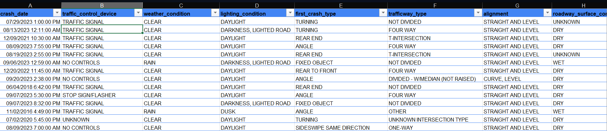

# Metropolis Traffic Crash & Safety Analysis Report
Analyzing city-wide incident data to optimize public safety responses and reduce crash severity using Power BI.

### Dashboard Preview

##  Executive Summary
Metropolis authorities lacked a unified, data-driven view of traffic incidents, making it difficult to correlate environmental factors with crash severity across various districts. This project integrated complex datasets including crash facts, vehicle units, and casualty demographics into a centralized Power BI dashboard.

### Key Achievements:
- Incident Visualization: Developed an interactive dashboard to track thousands of traffic crashes, enabling real-time filtering by severity and location.
- Risk Identification: Isolated high-risk "Hotspots" and peak incident hours, providing the police department with a roadmap for strategic patrol allocation.
- Safety Validation: Delivered insights into the primary contributing factors of fatal crashes, such as weather conditions and unit types, to support future road safety policies.

## The Business Problem
The Metropolis Police Department required a transition from static, manual incident logging to a dynamic reporting environment. The primary objective was to move away from
retrospective reporting to a proactive safety view that supports data-driven decisions.

### Key Questions Addressed:
- How have traffic incident rates (KPIs) changed year-over-year?
- Which urban districts and specific time slots exhibit the highest crash volumes?
- What roles (e.g., Driver vs. Passenger) and unit types are most frequently involved in high-severity incidents?

## The Process (Methodology)
- Tools Used: Power BI, Power Query, and DAX.
- Data Sourcing & Overview: The analysis utilized three primary relational datasets: Crashes_Fact, Units_involved, and People_involved.
- Data Cleaning & Transformation (ETL):
   -Relationship Mapping: Built a Star Schema to ensure individual casualties were correctly linked to their respective vehicles and crash events.
   - Calculated Measures: Created DAX measures to calculate Injury Rates, Fatality Percentages, and Year-over-Year incident changes.
   - Standardization: Cleaned and standardized incident descriptions (e.g., Rear-end, Angle) and weather categories to ensure reporting accuracy.

### Dataset Preview
   
   
## Analysis & Insights
### A. Crash Trends & Severity KPIs
- Volume Metrics: The analysis monitors total city-wide crashes, identifying significant seasonal spikes that correlate with adverse weather periods.
- Severity Breakdown: While "Property Damage Only" remains the most common outcome, the dashboard highlights a critical concentration of "Incapacitating Injuries" in specific urban sectors.
### B. Geographic & Unit Performance
- District Hotspots: Certain city districts were identified as high-volume zones, requiring more frequent intervention than surrounding residential areas.
- Unit Involvement: Passenger vehicles are the most frequent units involved, but motorcycles and pedestrians represent a disproportionately high percentage of fatal outcomes.
## C. Contributing Factors & Demographics
- Environmental Impact: Analysis indicates that poor lighting and nighttime conditions significantly increase the likelihood of severe multi-vehicle collisions.
- Casualty Profiling: By analyzing the People dataset, the report identifies specific age groups and occupant roles most at risk during peak traffic hours.

## Recommendations
Based on the Metropolis data analysis, the following actions are recommended:
- Strategic Resource Deployment: Increase traffic enforcement and police visibility in the identified "Hotspot" districts during identified peak-hour windows.
- Infrastructure Priority: Evaluate high-incident intersections for potential infrastructure upgrades, such as improved lighting or redesigned signaling.
- Public Safety Initiatives: Launch targeted awareness campaigns focusing on the primary collision types (e.g., rear-end or angle crashes) identified as the most frequent causes of injury.

 ## Links
 https://app.powerbi.com/view?r=eyJrIjoiOTgzYjgzYzUtNWRmYS00ODcxLWIyYjAtZGU2YzcyMzg4NDVjIiwidCI6IjllMDVmZmZjLTRiODctNGE3NS1hZDU3LWIyYjE4OWNiOTlhYiJ9

